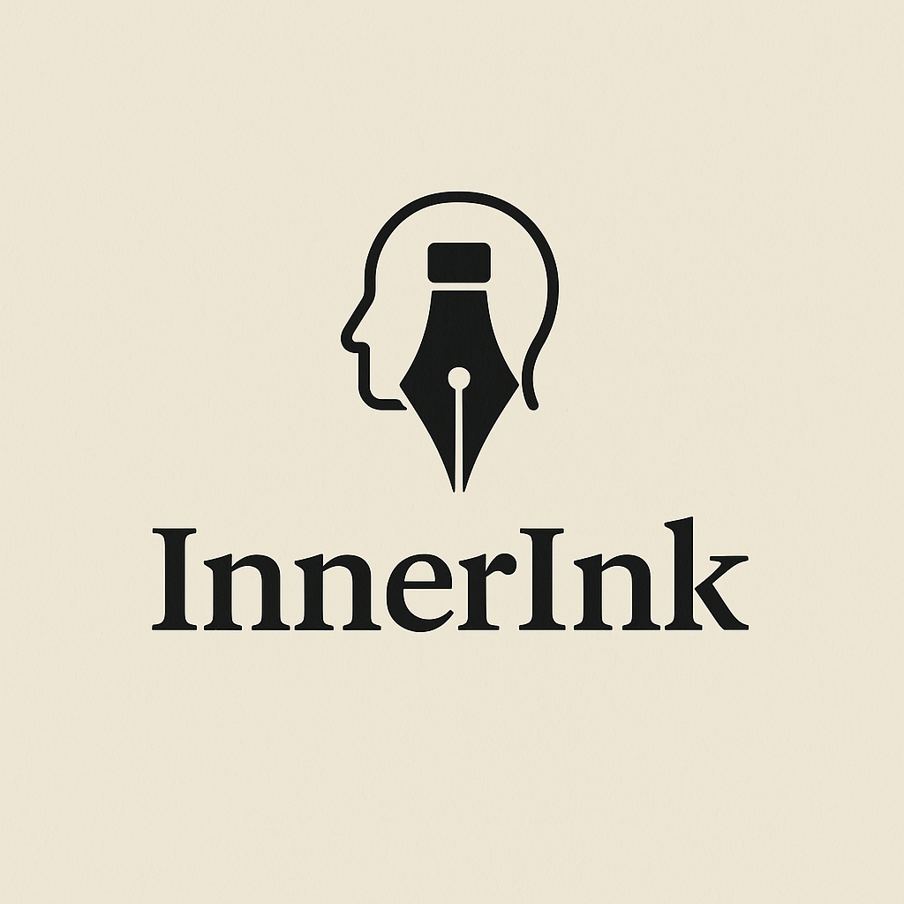

# InnerInk

A Personal Journal app allowing users to create journal entries and store them within their personal accounts

## What is InnerInk

InnerInk is a personal journaling app that gives users a safe, private space to reflect, write, and track their thoughts over time. With a clean, minimal interface and session-based login, users can create, edit, and organize journal entries securely. Each entry is tied to a user, ensuring privacy and personalization. Whether it’s daily reflections, mood tracking, or creative writing, InnerInk helps users stay connected to their inner voice—one entry at a time.

### User Stories- (InnerInk)

1. As a user, I want to view pages with a clean and consistent layout so that I can easily navigate the app and manage my journals and entries.

2. As a returning user, I want to log in using my credentials so that I can securely access my personal journals and entries.

3. As a new user, I want to sign up for an account so that I can start creating and organizing my own journals.

4. As a logged-in user, I want to stay logged in while browsing so I don’t have to log in again on every page.

5. As a user, I want to create multiple journals so that I can organize my entries by topic or purpose.

6. As a user, I want to add entries to specific journals so that my thoughts are grouped and easy to review later.

7. As a user, I want to create, edit, and delete my journal entries so that I can keep my thoughts up to date and remove anything I no longer want.

8. As a guest user, I should only be able to see the home or landing page so that my access is limited until I log in.

9. As a logged-in user, I want to make sure no one else can edit or delete my journals or entries so that my personal data stays private.

10. As a user, I want to access the app via a public link so that I can sign up and start journaling without installing anything.

# Logo

